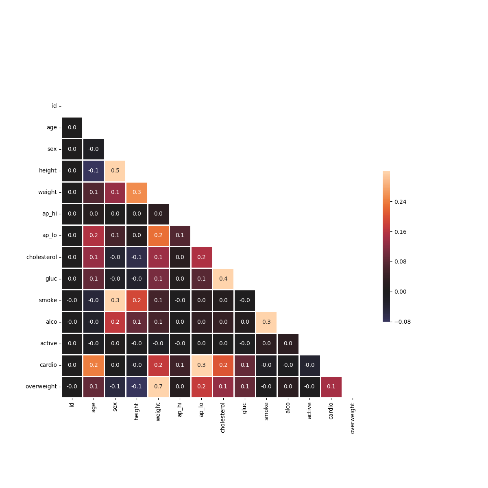

# Medical Data Visualizer

This project analyzes and visualizes medical examination data to explore relationships between cardiovascular disease, body measurements, blood markers, and lifestyle choices. It was developed as part of the freeCodeCamp Data Analysis with Python curriculum.

## Project Overview

The dataset contains patient information, including age, height, weight, blood pressure, cholesterol, glucose levels, lifestyle habits, and cardiovascular disease diagnosis.
The analysis involves:

* Data cleaning and normalization.
* Feature engineering to determine overweight status.
* Visualization of categorical variables.
* Visualization of correlations between medical indicators.
  
## Example Visualizations

### Categorical Plot

Displays feature distributions by cardiovascular disease status.


### Heat Map

Shows correlation between different medical measurements.

---

## Features Implemented

1. **Overweight Calculation**

   * BMI is calculated for each patient.
   * Patients with BMI > 25 are classified as overweight.

2. **Data Normalization**

   * Cholesterol and glucose values are normalized so that `0` represents good and `1` represents bad.

3. **Categorical Plot**

   * Shows counts of good and bad outcomes for selected variables (`cholesterol`, `gluc`, `alco`, `active`, `smoke`, `overweight`) separated by cardiovascular disease status.

4. **Heat Map**

   * Displays correlations between medical measurements after filtering invalid or extreme data.

## Technologies Used

* `Python`
* `Pandas`
* `Matplotlib`
* `Seaborn`
* `numpy`

## Dataset Description

| Feature     | Type        | Values / Units                                      |
| ----------- | ----------- | --------------------------------------------------- |
| age         | Objective   | days                                                |
| height      | Objective   | cm                                                  |
| weight      | Objective   | kg                                                  |
| gender      | Objective   | categorical                                         |
| ap\_hi      | Examination | systolic BP                                         |
| ap\_lo      | Examination | diastolic BP                                        |
| cholesterol | Examination | 1 = normal, 2 = above normal, 3 = well above normal |
| gluc        | Examination | 1 = normal, 2 = above normal, 3 = well above normal |
| smoke       | Subjective  | 0 = no, 1 = yes                                     |
| alco        | Subjective  | 0 = no, 1 = yes                                     |
| active      | Subjective  | 0 = no, 1 = yes                                     |
| cardio      | Target      | 0 = no disease, 1 = disease                         |

## How to Run the Project

1. Clone the repository:

   ```bash
   git clone https://github.com/RitaGr/boilerplate-medical-data-visualizer.git
   cd boilerplate-medical-data-visualizer
   ```
2. Install dependencies:

   ```bash
   pip install -r requirements.txt
   ```
3. Run the main script:

   ```bash
   python main.py
   ```

   
